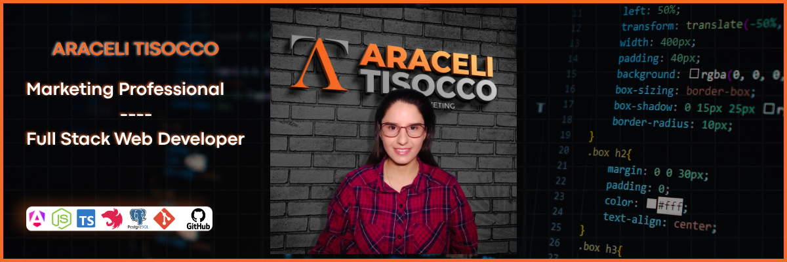

# ¡Hola! Mi nombre es Araceli Tisocco 👋

### Marketing Professional | Full Stack Web Developer | Web Applications | E-commerce | Digital Solutions

---

## 💼 Sobre mí

Soy profesional en Marketing y Desarrolladora Web Full Stack, con formación universitaria y una visión integral para el desarrollo de soluciones digitales orientadas a resultados.

Cuento con experiencia en el desarrollo de aplicaciones web tanto del lado del frontend como del backend, creando experiencias funcionales, modernas y centradas en el usuario. Además, desarrollo páginas web y tiendas online, integrando estrategia, diseño y tecnología para potenciar la presencia digital de marcas, emprendimientos y negocios.

Mi perfil combina conocimientos técnicos con una visión estratégica del marketing, permitiéndome comprender no solo cómo construir una solución digital, sino también cómo alinearla con objetivos comerciales, posicionamiento y experiencia del usuario.

Me caracterizo por ser una persona responsable, comprometida, organizada y con una visión holística del trabajo, enfocada en el aprendizaje continuo y la mejora constante.

---

## 🛠️ Tecnologías y herramientas

### Frontend

- Angular
- TypeScript
- HTML
- SCSS
- PrimeNG
- RxJS

### Backend

- Node.js
- NestJS
- TypeScript
- Express
- JWT

### Base de datos

- PostgreSQL
- TypeORM

### Herramientas y tecnologías

- Git
- GitHub
- Visual Studio Code
- Nginx
- Swagger

---

## 🚀 Proyecto destacado

### Sistema de Gestión de Proyectos

Aplicación web desarrollada para la gestión integral de proyectos, clientes, tareas y metas intermedias.

El sistema permite:

- 🔐 Inicio de sesión mediante usuario y contraseña.
- 📁 Crear, modificar y consultar proyectos.
- 👥 Gestionar clientes y asociarlos a proyectos.
- 📋 Crear y administrar tareas y metas intermedias.
- 📅 Definir fechas de inicio y finalización.
- 📊 Controlar el avance de tareas y metas.
- 📈 Consultar estadísticas y métricas mediante gráficos.
- 📝 Consultar el historial de información.
- 📤 Exportar información en formato CSV.

**Tecnologías utilizadas:** Angular · TypeScript · PrimeNG · NestJS · Node.js · TypeORM · PostgreSQL · Nginx

🎥 **[Ver demo del sistema en YouTube](https://youtu.be/XkpsWrzXVts?si=9HtEwMtNpx2wR-mq)**

---

## 💡 Áreas de interés

- Desarrollo de aplicaciones web
- Desarrollo Frontend y Backend
- E-commerce
- Marketing Digital
- Diseño y desarrollo de sitios web
- Soluciones digitales para empresas y emprendimientos
- Experiencia de usuario
- Estrategia y transformación digital

---

## 📫 Contacto y redes

- 🌐 **Página web:** [aracelitisocco.com](https://aracelitisocco.com/)
- 📘 **Facebook:** [facebook.com/tisoccoaraceli](https://www.facebook.com/tisoccoaraceli)
- 📸 **Instagram:** [@tisoccoaraceli](https://www.instagram.com/tisoccoaraceli)
- ▶️ **YouTube:** [@AraceliTisocco](https://www.youtube.com/@AraceliTisocco)
- 💻 **GitHub:** [github.com/tisoccoaraceli4](https://github.com/tisoccoaraceli4)

---

### ✨ Siempre aprendiendo, creando y desarrollando nuevas soluciones digitales.
